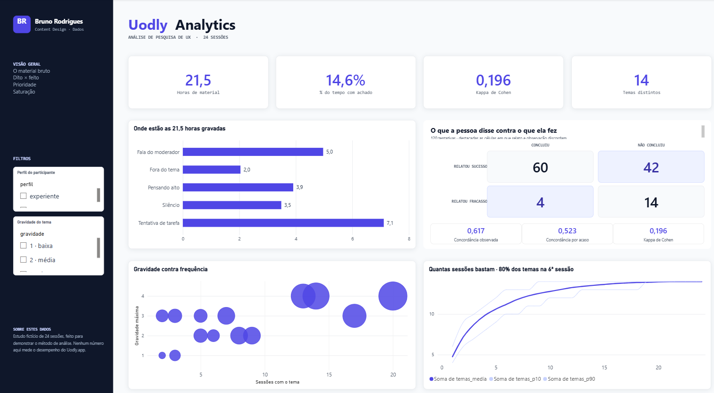
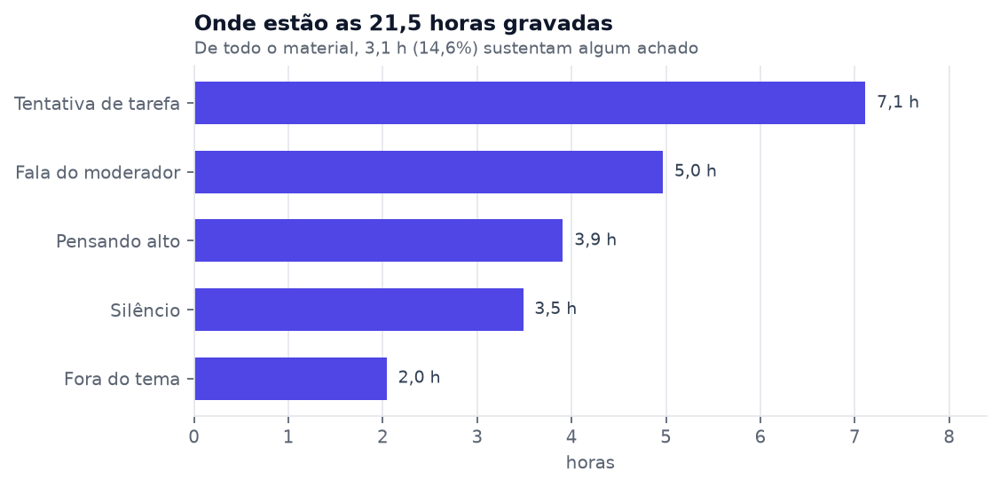
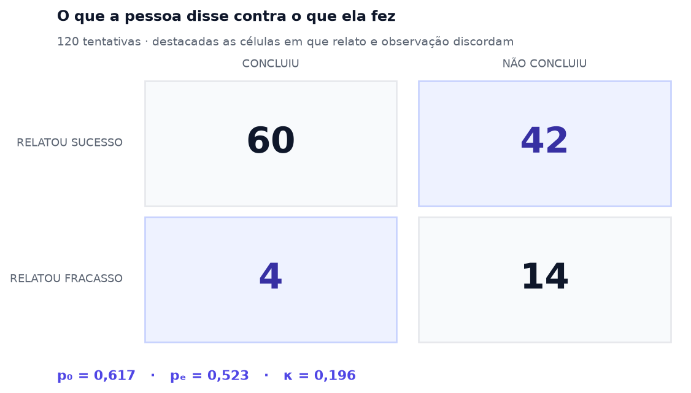
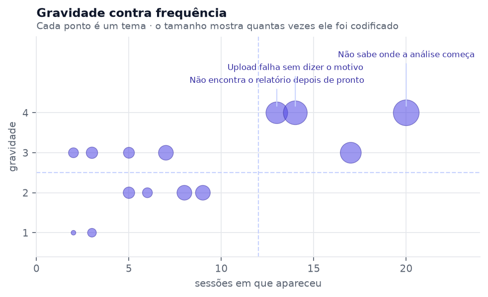
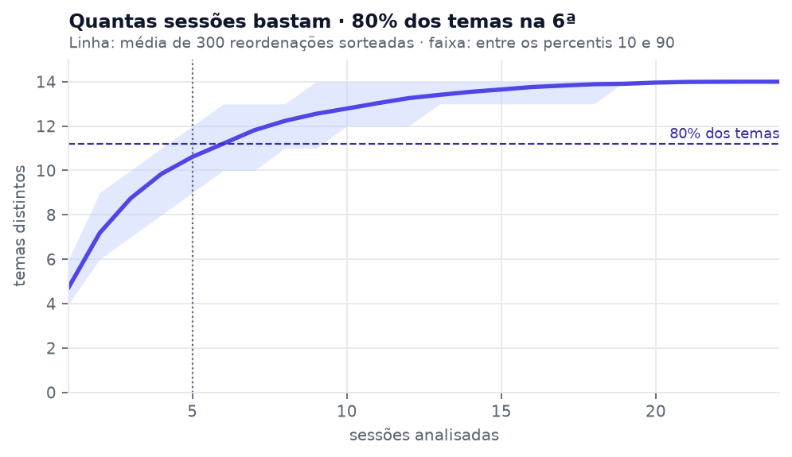

# Análise de pesquisa de UX em Power BI · caso Uodly.app

<p align="center">
  
</p>

> **Aviso sobre os dados.** O corpus deste repositório é **fictício**. O
> Uodly.app é um produto em operação, e este estudo não o avalia: nenhum número
> aqui mede acurácia, tempo economizado ou qualidade de saída da ferramenta. O
> que o projeto demonstra é o **método de análise**. As distribuições foram
> escolhidas para reproduzir padrões conhecidos de pesquisa de UX, não para
> favorecer uma conclusão.

---

## 1. Descrição do projeto

Um estudo de usabilidade produz muito material e pouca evidência. Vinte e quatro
sessões gravadas viram horas de vídeo que alguém precisa assistir inteiras para
encontrar os minutos que importam — e, no fim, uma lista de prioridades cuja
ordem depende de um critério que quase nunca é dito em voz alta.

Este repositório percorre esse caminho de ponta a ponta: gera o corpus, analisa
em Python, traduz para um modelo dimensional e entrega um painel em Power BI
cujo layout é **escrito por código**, não arrastado na tela.

São cinco perguntas, cada uma com um veredito:

| # | Pergunta | Resultado |
|---|----------|-----------|
| 01 | Quanto de uma gravação vira evidência? | **Confirmada** — 14,6% |
| 02 | O relato da pessoa basta para medir sucesso? | **Refutada** — κ = 0,196 |
| 03 | Frequência e gravidade apontam o mesmo? | **Parcialmente** |
| 04 | Cinco sessões bastam? | **Refutada** — são 6 |
| 05 | A lista muda conforme o critério? | **Confirmada** — 4 trocas |

---

## 2. Tecnologias

**Python** — `pandas`, `numpy`, `scipy`, `matplotlib`, `openpyxl`
**Power BI** — projeto `.pbip`, modelo semântico em TMDL, relatório em PBIR
**DAX** — 25 medidas, entre elas o kappa de Cohen decomposto em três parcelas

---

## 3. Estrutura

```
analise/     scripts: geram o corpus, analisam, montam o painel e as imagens
dados/       o corpus em CSV e a planilha que o Power BI consome
imagens/     os gráficos deste README
powerbi/     o projeto .pbip — modelo em TMDL e relatório em PBIR
```

---

## 4. O problema: onde está o sinal



De 21,5 horas gravadas, **3,1 sustentam algum achado** — 14,6%. O resto não é
desperdício: é o moderador falando, silêncio enquanto a pessoa lê, conversa
fora do tema. Tudo isso precisa ser assistido para que os 14,6% apareçam.

É essa desproporção que torna a análise manual cara. Não é que o material seja
ruim — é que a densidade de sinal é baixa, e só se descobre onde ela está
depois de passar por tudo.

---

## 5. Os achados

### 5.1 Perguntar não basta



85% das tentativas terminaram com a pessoa dizendo que deu certo. 53,3%
terminaram com a tarefa concluída. A diferença são **42 tentativas** em que
alguém afirmou ter conseguido algo que não conseguiu — não por má-fé, mas por
não saber que o resultado esperado era outro.

O kappa de 0,196 mede exatamente isso: descontada a concordância que
aconteceria por acaso, relato e observação quase não se sobrepõem. Se bastasse
perguntar, bastaria uma pesquisa.

### 5.2 Gravidade e frequência competem



Os três temas de gravidade máxima estão todos na metade frequente — o quadrante
que nenhum time discute. Mas a correspondência não é perfeita, e é aí que mora
a decisão: temas frequentes e leves incomodam muita gente sem quebrar nada;
temas raros e graves impedem a conclusão de quem os encontra. Os dois disputam
o mesmo lugar no backlog.

### 5.3 A regra dos cinco usuários não se sustenta



Com 5 sessões chega-se a 10,6 dos 14 temas — 76%. Parece muito, e é o número
que sustenta a regra de bolso. Mas os 24% que faltam não são um resto
aleatório: são justamente os temas raros. Só na **sexta** sessão, em média, se
chega a 80%.

A leitura honesta é que a regra vale para o que se quer descobrir. Para achar
os problemas comuns, 5 sessões bastam e sobram. Para decidir o que *não* está
na lista — que é o que uma priorização precisa saber — 5 é pouco, e a faixa
entre os percentis mostra que o azar de uma ordem ruim custa dois ou três
temas.

---

## 6. O painel

O relatório é gerado por `analise/montar_dashboard.py`, que grava os arquivos
`visual.json` do formato PBIR diretamente. Layout em código significa que
trocar a paleta, reposicionar tudo ou acrescentar uma página é edição de
script — não é arrastar trinta objetos na tela.

As medidas estão em `powerbi/Uodly Analytics.SemanticModel/definition/tables/`.
Vale olhar `fato_tarefa.tmdl`: o kappa de Cohen está decomposto em três medidas
— concordância observada, concordância esperada por acaso e o resultado — para
que o painel possa mostrar a conta, não só o número.

### Como abrir

1. Abra `powerbi/Uodly Analytics.pbip` no Power BI Desktop. É preciso ter
   **Arquivo → Opções → Recursos de visualização → Power BI Project (.pbip)**
   marcado, e reiniciar o Desktop depois de marcar.

2. Vá em **Transformar dados → Gerenciar parâmetros** e troque `PastaDados`
   pelo caminho da pasta `dados` deste repositório na sua máquina.

3. **Atualizar** para carregar os dados.

---

## 7. Como refazer tudo do zero

```bash
pip install -r requirements.txt

python analise/gerar_dados.py          # gera o corpus sintético
python analise/analise.py              # roda a análise em Python
python analise/exportar_powerbi.py     # traduz para modelo dimensional
python analise/montar_dashboard.py     # escreve os visuais do relatório
python analise/gerar_imagens.py        # refaz os gráficos deste README
```

---

## 8. Onde isso aparece

Este caso integra o portfólio em
[bruno-dados-python.vercel.app](https://bruno-dados-python.vercel.app/projetos/uodly),
onde a mesma análise está em versão web e interativa.
